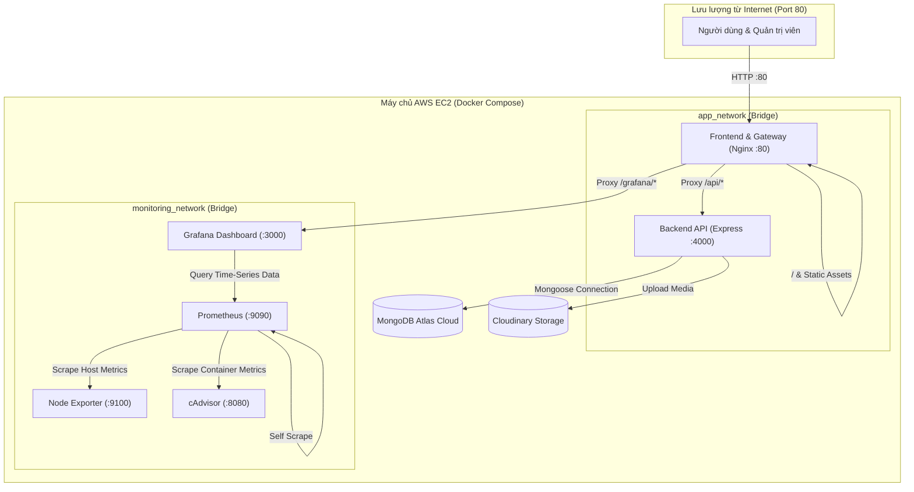

# 🏸 Badminton E-Commerce & DevSecOps Platform

Hệ thống web thương mại điện tử chuyên cung cấp thiết bị và phụ kiện cầu lông, tích hợp đầy đủ phân hệ Khách hàng (Customer Storefront), Cổng Quản trị (Admin Portal), quy trình tự động hóa **DevSecOps (CI/CD)** đa tầng và hệ sinh thái giám sát vận hành **Observability (Prometheus & Grafana)** trên nền tảng đám mây AWS EC2.

---

## 📑 Mục lục
- [1. Kiến trúc hệ thống (System Architecture)](#1-kiến-trúc-hệ-thống-system-architecture)
- [2. Công nghệ sử dụng (Tech Stack)](#2-công-nghệ-sử-dụng-tech-stack)
- [3. Cấu trúc thư mục dự án](#3-cấu-trúc-thư-mục-dự-án)
- [4. Các tính năng nổi bật](#4-các-tính-năng-nổi-bật)
- [5. Điểm nhấn Kỹ thuật & DevOps](#5-điểm-nhấn-kỹ-thuật--devops)
- [6. Hướng dẫn Cài đặt & Khởi chạy (Getting Started)](#6-hướng-dẫn-cài-đặt--khởi-chạy-getting-started)
  - [Chạy môi trường Local Development](#chạy-môi-trường-local-development)
  - [Chạy toàn bộ hệ thống bằng Docker Compose](#chạy-toàn-bộ-hệ-thống-bằng-docker-compose)
- [7. Quy trình Tự động hóa CI/CD & DevSecOps](#7-quy-trình-tự-động-hóa-cicd--devsecops)
- [8. Giám sát & Vận hành (Monitoring & Observability)](#8-giám-sát--vận-hành-monitoring--observability)

---

## 1. Kiến trúc hệ thống (System Architecture)

Dự án được phân tách thành các container độc lập, định tuyến tập trung qua cổng Gateway Nginx trên cổng HTTP `80` và phân tách thành 2 mạng Docker riêng biệt (`app_network` và `monitoring_network`):



---

## 2. Công nghệ sử dụng (Tech Stack)

### Frontend
- **Framework & Bundler:** React 19, Vite 5.
- **Routing:** React Router DOM v7 (quản lý phân quyền `publicRoutes` và `privateRoutes`).
- **Giao diện & Tiện ích:** Vanilla CSS, Lucide React, Recharts (biểu đồ doanh thu), Slick Carousel, React Toastify, Vietnam Provinces.
- **Web Server:** Nginx Alpine (Reverse Proxy, API Rate Limiting, HTTP Security Headers).

### Backend
- **Nền tảng:** Node.js v24 (Alpine), Express 5.
- **Cơ sở dữ liệu:** MongoDB Atlas thông qua Mongoose ODM.
- **Xác thực & Bảo mật:** JWT (Access Token & Refresh Token), bcryptjs.
- **Lưu trữ & Dịch vụ:** Cloudinary & Multer (upload hình ảnh sản phẩm), Nodemailer (gửi email thông báo/khôi phục mật khẩu).
- **Process Management:** `tini` làm tiến trình Init, chạy với Non-root user (`nodeuser`).

### DevOps & Hạ tầng
- **Điều phối Container:** Docker & Docker Compose v2.
- **CI/CD Pipeline:** GitHub Actions (Buildx, Cache GHA, Matrix).
- **Bảo mật DevSecOps:** Semgrep (SAST), Trivy FS (SCA), Trivy Image (Container Scanning).
- **Mạng riêng bảo mật:** Tailscale VPN (Zero-Trust Deployment không mở port SSH ra Internet).
- **Monitoring & Observability:** Prometheus v3, Grafana v13, cAdvisor, Node Exporter.
- **Hosting:** AWS EC2 (Ubuntu).

---

## 3. Cấu trúc thư mục dự án

```text
Badminton/
├── .github/
│   └── workflows/
│       └── deploy.yml          # GitHub Actions DevSecOps CI/CD pipeline
├── prometheus/
│   └── prometheus.yml          # Cấu hình scrape metrics cho Prometheus
├── src/
│   ├── backend/
│   │   ├── config/             # Cấu hình kết nối MongoDB
│   │   ├── controllers/        # Xử lý logic nghiệp vụ API
│   │   ├── middleware/         # Xác thực JWT, phân quyền role, CORS
│   │   ├── models/             # Schema Mongoose (User, Product, Order, Cart...)
│   │   ├── routes/             # Định tuyến RESTful APIs
│   │   ├── Dockerfile          # Multi-stage build Node 24 Alpine, non-root, tini
│   │   ├── package.json        # Dependencies backend
│   │   └── server.js           # Điểm khởi chạy ứng dụng Express
│   └── frontend/
│       ├── public/             # Static assets
│       ├── src/
│       │   ├── components/     # UI Components dùng chung (Navbar, Footer, Popup...)
│       │   ├── layouts/        # Layout khách hàng, giỏ hàng, trang quản trị
│       │   ├── pages/          # Phân hệ giao diện (customer/ và admin/)
│       │   ├── routes/         # Cấu hình định tuyến trang & phân quyền
│       │   ├── services/       # Giao tiếp HTTP API với backend
│       │   ├── App.jsx         # Component gốc ứng dụng
│       │   └── index.jsx       # Điểm gắn kết React DOM
│       ├── Dockerfile          # Multi-stage build React -> Nginx Alpine
│       ├── nginx.conf          # Cấu hình Nginx proxy, rate limit, security headers
│       ├── vite.config.js      # Cấu hình Vite & proxy môi trường dev
│       └── package.json        # Dependencies frontend
├── docker-compose.yml          # Định nghĩa 6 services chạy production & monitoring
└── README.md                   # Tài liệu hướng dẫn dự án
```

---

## 4. Các tính năng nổi bật

### Phân hệ Khách hàng (Customer Storefront)
- 🛒 **Duyệt & Tìm kiếm:** Phân loại vợt, giày, balo, phụ kiện; lọc đa tiêu chí theo giá, thương hiệu, danh mục.
- 📦 **Chi tiết sản phẩm:** Xem thông số kỹ thuật, hình ảnh minh họa chất lượng cao, đánh giá/rating từ người mua.
- 🛍️ **Giỏ hàng & Đặt hàng:** Thêm/sửa/xóa sản phẩm trong giỏ, chọn địa chỉ tỉnh/thành phố, áp dụng mã giảm giá (voucher).
- 📜 **Quản lý đơn hàng:** Tra cứu lịch sử đơn hàng, trạng thái xử lý, yêu cầu đổi trả/hoàn tiền.
- 👤 **Tài khoản:** Đăng ký, đăng nhập JWT, chỉnh sửa hồ sơ, quên mật khẩu qua email OTP.

### Phân hệ Quản trị (Admin Portal)
- 📊 **Dashboard Doanh thu:** Trực quan hóa doanh thu theo ngày/tháng với biểu đồ Recharts.
- 📦 **Quản lý Sản phẩm:** Thêm mới, chỉnh sửa thông tin, tải ảnh sản phẩm lên Cloudinary, phân loại danh mục và thương hiệu.
- 📑 **Quản lý Đơn hàng:** Xem tất cả đơn, duyệt đơn hàng, xử lý đơn đổi trả/hoàn tiền, quản lý đơn bị hủy.
- 🏷️ **Quản lý Khuyến mãi:** Tạo mã voucher giảm giá theo phần trăm hoặc số tiền cố định, cài đặt thời hạn sử dụng.
- 👥 **Quản lý Người dùng:** Danh sách khách hàng, khóa/mở khóa tài khoản người dùng.

---

## 5. Điểm nhấn Kỹ thuật & DevOps

> [!TIP]
> Hệ thống được thiết kế theo các tiêu chuẩn vận hành hiện đại, đảm bảo tính ổn định, bảo mật và khả năng quan sát cao:

1. **Bảo mật Container (Container Security Hardening):**
   - Áp dụng kỹ thuật **Multi-Stage Build** trên cả Backend và Frontend để tối thiểu hóa dung lượng image và loại bỏ toàn bộ công cụ build không cần thiết.
   - Backend chạy dưới quyền tài khoản **Non-root (`nodeuser`)**.
   - Tích hợp tiến trình init **`tini`** giúp xử lý triệt để zombie processes và chuyển tiếp tín hiệu tắt graceful (`SIGTERM`/`SIGINT`).
2. **Cổng Gateway Nginx kiêm Phòng vệ mạng:**
   - **Rate Limiting:** Giới hạn tần suất gọi API tối đa `10 requests/giây` trên mỗi IP (`zone=api_limit:10m`), trả về mã `429 Too Many Requests` khi có dấu hiệu tấn công DoS/brute-force.
   - **Bộ HTTP Security Headers chuẩn OWASP:** Bật sẵn `Content-Security-Policy`, `X-Frame-Options: SAMEORIGIN` (chống Clickjacking), `X-Content-Type-Options: nosniff`, `Referrer-Policy`.
   - **Tối ưu Caching:** Cấu hình `Cache-Control "public, immutable"` với thời hạn 1 năm cho toàn bộ tài nguyên tĩnh.
3. **Phân tách mạng (Network Segmentation):**
   - Mạng `app_network` dành riêng cho tương tác giữa Frontend, Backend và Grafana.
   - Mạng `monitoring_network` cách ly hệ thống giám sát (Prometheus, cAdvisor, Node Exporter), không để lộ các metrics nội bộ ra ngoài.
4. **Log Rotation & Quản lý đĩa:**
   - Cấu hình `json-file` log driver cho toàn bộ 6 service với giới hạn `max-size: "10m"`, `max-file: "3"`, `compress: "true"`, ngăn ngừa lỗi tràn dung lượng ổ cứng EC2.
5. **Zero-Trust Deployment qua Tailscale VPN:**
   - Quá trình deploy từ GitHub Actions kết nối vào mạng riêng Tailnet của EC2. **Không cần mở cổng SSH 22 công khai trên AWS Security Group**.

---

## 6. Hướng dẫn Cài đặt & Khởi chạy (Getting Started)

### Yêu cầu tiên quyết
- [Node.js](https://nodejs.org/) >= 20.0.0
- [Docker](https://www.docker.com/) & Docker Compose v2
- Tài khoản [MongoDB Atlas](https://www.mongodb.com/atlas) & [Cloudinary](https://cloudinary.com/)

---

### Chạy môi trường Local Development

#### 1. Cấu hình biến môi trường
Tạo file `.env` bên trong thư mục `src/backend/.env`:
```env
MONGO_DB=mongodb+srv://<username>:<password>@<cluster>.mongodb.net/
CLOUDINARY_CLOUD_NAME=your_cloud_name
CLOUDINARY_API_KEY=your_api_key
CLOUDINARY_API_SECRET=your_api_secret
PORT=4000

ACCESS_TOKEN=your_jwt_access_secret_key
REFRESH_TOKEN=your_jwt_refresh_secret_key

EMAIL_USER=your_email@gmail.com
EMAIL_PASS=your_email_app_password

DOCKER_USERNAME=your_dockerhub_username
NODE_ENV=development
```

#### 2. Khởi chạy Backend
```bash
cd src/backend
npm install
npm run dev
# Backend khởi chạy tại http://localhost:4000 (Healthcheck: http://localhost:4000/api/health)
```

#### 3. Khởi chạy Frontend
Mở một terminal mới:
```bash
cd src/frontend
npm install
npm run dev
# Frontend khởi chạy tại http://localhost:3000 (Vite tự động proxy /api sang port 4000)
```

---

### Chạy toàn bộ hệ thống bằng Docker Compose

Để kiểm thử toàn bộ cụm ứng dụng và hệ thống giám sát giống như trên môi trường Production:

1. Tạo file `.env` tại thư mục gốc dự án:
```env
DOCKER_USERNAME=jewelkaz
IMAGE_TAG=latest
MONGO_DB=mongodb+srv://<username>:<password>@<cluster>.mongodb.net/
CLOUDINARY_CLOUD_NAME=your_cloud_name
CLOUDINARY_API_KEY=your_api_key
CLOUDINARY_API_SECRET=your_api_secret
PORT=4000
ACCESS_TOKEN=your_access_token_secret
REFRESH_TOKEN=your_refresh_token_secret
EMAIL_USER=your_email@gmail.com
EMAIL_PASS=your_email_app_password
GRAFANA_ADMIN_USER=admin
GRAFANA_ADMIN_PASSWORD=admin
EC2_PUBLIC_IP=localhost
```

2. Khởi chạy tất cả các containers:
```bash
docker compose up -d
```

3. Kiểm tra trạng thái containers:
```bash
docker compose ps
```

4. Truy cập dịch vụ:
- **Ứng dụng Web (Frontend & API):** [http://localhost](http://localhost)
- **Kiểm tra API Health:** [http://localhost/api/health](http://localhost/api/health)
- **Hệ thống giám sát Grafana:** [http://localhost/grafana/](http://localhost/grafana/) (Đăng nhập: `admin` / `admin`)

---

## 7. Quy trình Tự động hóa CI/CD & DevSecOps

Toàn bộ quy trình tự động hóa được định nghĩa tại file [.github/workflows/deploy.yml](.github/workflows/deploy.yml), thực thi tự động khi push code lên nhánh `main`:

| Giai đoạn (Job) | Công cụ / Hành động | Mô tả mục tiêu |
| :--- | :--- | :--- |
| **1. SAST Scan** | `returntocorp/semgrep-action` | Quét phân tích tĩnh mã nguồn JavaScript tìm kiếm các mẫu code tiềm ẩn lỗi bảo mật. |
| **2. SCA Scan** | `aquasecurity/trivy-action` (FS) | Quét file phụ thuộc thư viện để phát hiện các lỗ hổng đã công bố (mức `CRITICAL, HIGH`). |
| **3. Build & Push** | `docker/build-push-action` | Build multi-platform với Docker Buildx, sử dụng cache GitHub Actions (`gha`) đẩy image lên Docker Hub. |
| **4. Image Scan** | `aquasecurity/trivy-action` (Image) | Quét lỗ hổng của các container image vừa build trước khi kéo về máy chủ. |
| **5. VPN Deploy** | `tailscale/github-action` & SSH | Kết nối VPN Tailscale vào mạng nội bộ EC2, dùng SCP đồng bộ cấu hình và chạy `docker compose up -d`. |
| **6. Verification** | Bash Script Validation | Tự động kiểm tra endpoint `/api/health`, rà soát các container bị crash, và xác thực trạng thái Prometheus targets. |

### Cấu hình Secrets cần thiết trên GitHub Repository
| Secret Name | Mô tả |
| :--- | :--- |
| `DOCKER_USERNAME` | Tên tài khoản Docker Hub |
| `DOCKER_PASSWORD` | Mật khẩu hoặc Access Token Docker Hub |
| `AWS_EC2_HOST` | Địa chỉ IP Tailscale của máy chủ EC2 (dạng `100.x.y.z`) |
| `AWS_EC2_USERNAME` | Username đăng nhập EC2 (mặc định: `ubuntu`) |
| `AWS_EC2_SSH_KEY` | Nội dung private key SSH (`.pem`) để truy cập máy chủ |
| `TAILSCALE_AUTHKEY` | Auth key được tạo từ Tailscale Admin Console (chọn loại Reusable & Ephemeral) |

---

## 8. Giám sát & Vận hành (Monitoring & Observability)

Cụm giám sát được tích hợp sẵn với cấu hình scrape 15s tại [prometheus/prometheus.yml](prometheus/prometheus.yml):

- **Node Exporter:** Thu thập thông số tài nguyên máy chủ EC2:
  - Tải CPU (`node_cpu_seconds_total`)
  - Sử dụng bộ nhớ RAM (`node_memory_MemAvailable_bytes`)
  - Dung lượng và I/O đĩa cứng (`node_filesystem_avail_bytes`)
  - Băng thông mạng (`node_network_receive_bytes_total`)
- **cAdvisor:** Thu thập thông số hiệu năng chi tiết của từng container Docker:
  - CPU usage theo container (`container_cpu_usage_seconds_total`)
  - Mức chiếm dụng RAM theo container (`container_memory_usage_bytes`)
  - Lưu lượng mạng vào/ra container (`container_network_transmit_bytes_total`)
- **Prometheus:** Lưu trữ dạng Time-Series Database và cung cấp giao diện truy vấn PromQL.
- **Grafana:** Cung cấp bảng điều khiển trực quan (Dashboard), được định tuyến an toàn qua Nginx tại địa chỉ `http://<IP_MAY_CHU>/grafana/`.

---

## 👥 Nhóm Tác Giả & Đóng Góp
- Dự án môn học DevOps / Web Application Development.
- Giấy phép: MIT License.
